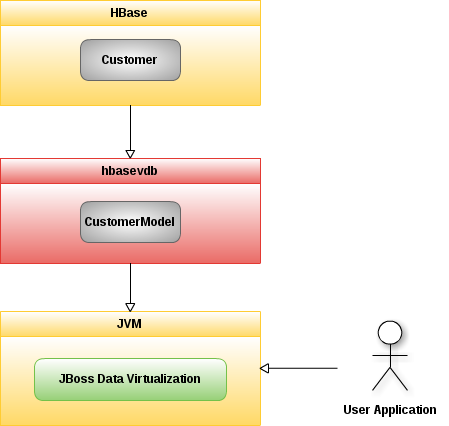
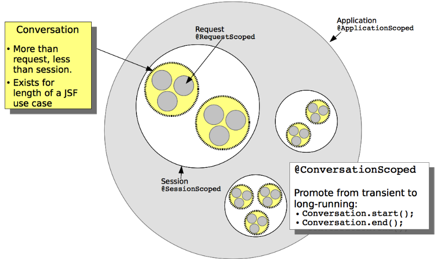

# CONTEXTS AND DEPENDENCY INJECTION

## CDI 概念

CDI(Contexts and Dependency Injection)，即上下文依赖注入，它是众多JEE规范中的一个. 

从Java EE6开始CDI正式成为Java EE规范，依赖注入相对成熟，相关的流行框架包括Spring，Google Guice等。

Java EE7 中 CDI 1.1
* https://jcp.org/en/jsr/detail?id=346

### 什么是上下文

如下图为用户登陆应用示例图

用户发送 login request 到服务器 -> 服务器获取 request 中数据(username/password)做验证 -> 服务器存储数据(username/password)到数据库 -> 服务器返回成功消息

当前应用的特点: 客户端服务器端多次交互

如何保存有状态的数据: Java EE服务器通过提供数据结构(Servlet 规范中的 Application,Session,Request)保存有状态的数据

CDI 规范提供四种数据结构(Application,Session,Conversation,Request)，它们在应用中生命周期不同，我们将其称之为上下文，如下图

* Application - 应用程序上下文，即数据在应用程序上下文中可用。换句话，数据在应用程序部署到应用程序卸载或删除这段时间可用。这是最高级别的上下文。
* Session - 会话上下文，即数据存储在会话中，数据只有在会话被某一用户创建到会话被移除这段时间内被这个用户可用。
* Conversation - CDI新增加的上下文，它的作用范围是同一个会话中几个请求的总和
* Request - 请求上下文，数据只有在同一个用户的同一个请求中可用，当请求返回，数据不再被服务器维护

### 依赖注入

Dependency Injection, as specified by CDI, is the process by which objects can be inserted into other application objects in a typesafe manner. The decision of which particular implementation of an object will be injected can be delayed until the time of application deployment. In other frameworks injection is based upon string matching. CDI improves upon this through typed injection where the types are checked at compile time. This exposes injection errors earlier in the development lifecycle and makes debugging easier.

One of the major benefits of dependency injection (DI) is loose coupling of application components. The client and server components are loosely coupled because several different versions of the server can be injected into the client. The client works with an interface and is oblivious to which server it is talking to. Taking advantage of the deploy time injection, we can use specific objects for different types of environments such as production and test environments. For example, we can inject a production or test datasource depending upon our deployment environment.

### 其他CDI的特性

除了上下文和依赖注入外，CDI还提供了一些其他特性：

* EL表达式的扩展：CDI中默认支持EL表达式并对其进行了扩展，比如在JSF或JSP中，默认是不支持EL表达式传参的，如果结合CDI，那么就可以在EL表达式中传参数给后台Bean。
* 拦截器：CDI提供了一个十分方便的方法来实现一个或多个拦截器，用来处理 cross-cutting concerns such as logging
* 装饰器：装饰器可以让你动态的扩展或者重写现有的业务接口。这个功能十分方便，在CDI中，你在调用一个接口的实现类的时候，无须关心这个实现类的名称，所以在你更换新的实现的时候无需去修改你的代码，只需要在新的接口上面通过装饰器声明你要替换的之前的接口实现，然后在 bean.xml 中声明一下即可。
* 事件：CDI 提供了一种松耦合性的事件发送和接受机制。
* 注解：CDI中所有的注入都是通过注解来完成的，XML相关的配置非常少

## CDI 的优点

我们可从如下几个方面讨论CDI 的优点

* Dependency Injection
* Interceptors
* Decorators
* Events

## Weld

Weld是的CDI实现。Weld作为CDI的实现框架被Java EE容器，WEB容器，甚至Java SE使用。JBoss 7，WildFly，GlassFish 3 是Java EE容器，他们使用Weld提供CDI支持。新版本的Tomcat 及 Jetty 6.1 是WEB容器，他们也通过Weld提供CDI支持。Weld甚至可以用在Java SE环境。

http://docs.jboss.org/weld/reference/latest/en-US/html/index.html

## 示例 - I

[cdi-injection 示例](cdi-injection/README.md)

