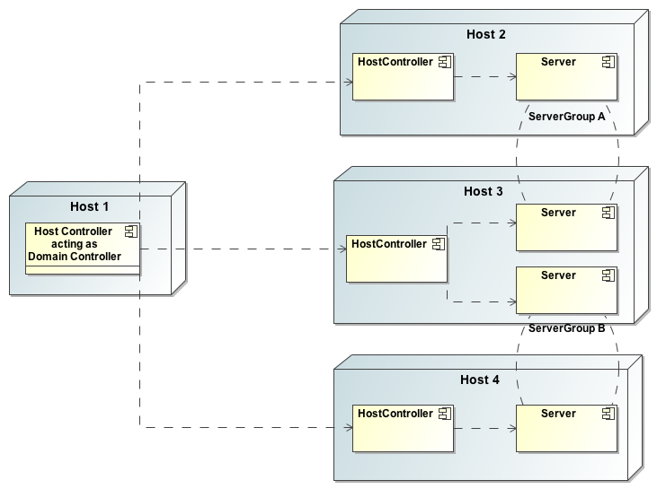
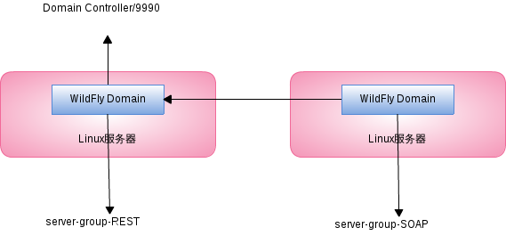

## Understanding WildFly

WildFly implements the Java EE 7 specification [1]. There are currently two profiles defined in Java EE 7:

* **Full Profile** - which contains all of the Java EE technologies.
* **Web Profile** - which only contains the web-based technologies of Java EE.

## What's New in WildFly

* **Cloud Ready Architecture** - WildFly was designed and architected for use everywhere (on premise; private clouds; public clouds).
* **World-Class Developer Productivity** - Fast, Simplified Configuration Files, Lightweight, Modular, Domains, New Management Tools

## Standalone Mode vs Domain Mode, Host vs Server

* HC管理同一台Host上的Server
* DC通过HC管理Domain中的所有Server
* 同一个Domain中的一个或多个Server组成一个 Server Group
* 配置HC为Master,则HC为DC
* PC负责启动DC/HC和Server

> More detais about Standalone, Domain, Host, Server please refer to WildFly Document [2].

## 实验 I - The Management Console

**实验目的** 

After completing this exercise, you will be able to login to the WildFly Management Console.

**实验结果** 

Access to the Management Console, as well as your WildFly will be bound to your local IP address.

**实验步骤** 

* Start WildFly in Standalone Mode
* Verify WildFly is Running
* Define Administrator Credentials
* Verify the New Management User
* Login to the Management Console
* View the Profile Page

~~~
$ ./add-user.sh admin password1!
Added user 'admin' to file '.../standalone/configuration/mgmt-users.properties'
Added user 'admin' to file '.../domain/configuration/mgmt-users.properties'

$ ./bin/standalone.sh

$ ./standalone.sh -b 10.0.0.1 -bmanagement=10.0.0.1
$ ./standalone.sh –b 0.0.0.0 –bmanagement=0.0.0.0

$ ./bin/standalone.sh -Djboss.bind.address=10.0.0.1 -Djboss.bind.address.management=10.0.0.1
~~~

## 实验 II - Domain配置示例

**实验描述**

* SOAP应用部署在server-group-SOAP，且需要备份节点以及水平扩展和弹性扩展
* REST应用部署在server-group-REST
* 单点统一管理
* 热部署

**实验目的** 

明白 WildFly 的 Domain, Host, Server 

**实验结果** 

对 Domain 进行操作, 管理, 部署

**实验步骤**

* SOAP应用相关的配置

~~~
$ unzip wildfly-8.2.0.Final.zip
$ cd wildfly-8.2.0.Final
$ cp -a domain/ soap
$ ./bin/domain.sh -Djboss.domain.base.dir=soap/

$ ./bin/jboss-cli.sh --connect --file=domain/soap.cli
~~~

* REST应用相关的配置

~~~
$ unzip wildfly-8.2.0.Final.zip
$ cd wildfly-8.2.0.Final
$ ./bin/add-user.sh

$ cp -a domain/ rest
$ ./bin/domain.sh -Djboss.domain.base.dir=rest

$ ./bin/jboss-cli.sh --connect --file=domain/rest.cli
~~~

* HC相关配置

[domain.config](domain/domain.config)

> NOTE: 确保host名字唯一, 配置security-realm, 配置domain-controller

* 启动 DC 和 HC

~~~
$ ./bin/domain.sh -Djboss.domain.base.dir=rest -b 192.168.1.101 -bmanagement=192.168.1.101
$ ./bin/domain.sh -Djboss.domain.base.dir=soap/ -Djboss.domain.master.address=192.168.1.101 -b 192.168.1.102
~~~

* 测试

热部署soap.war及rest.war, SOAP应用水平扩展和弹性扩展测试, 应用测试

## Configuring the Security Subsystem

Security in WildFly is configured in the Security Subsystem. The Security Subsystem has the following four configurable elements:

* security-management: used to override some of the high level implementation details of the PicketLink implementation.
* subject-factory: responsible for creating subject instances.
* security-domains: contains the configuration specific to your deployed applications.
* security-properties: used to specify additional properties.

The format of a security-domain definition in Security Subsystem looks like:

~~~
<security-domains>
    <security-domain>  
        <authentication>
	     <login-module>
		...
	    </login-module>
	</authentication>
    </security-domain>
</security-domains>
~~~

Some common examples of login modules include:

* Database
* LDAP
* Kerberos
* Plain-text files
* Single-sign on frameworks

> NOTE: The management interfaces run outside of the WildFly server process, so the Security Subsystem is not available to them. Therefore, the Management Console has it's own security settings.

## Defining a Database Security Realm

A database security realm has the following settings:

* dsJndiName: the JNDI name of the datasource connection pool.
* principalsQuery: a SQL statement that selects the principal's password.
* rolesQuery: a SQL statement that selects the principal's roles.
* suspendResume: should any existing JTA transaction be suspended during DB operations. The default is true.

Here is an example of a database security realm:

~~~
<security-domain name="myDB_domain">
    <authentication>
	<login-module code="Database" flag="required">
	    <module-option name="dsJndiName" value="java:app/myDS"/>
	    <module-option name="principalsQuery" value="select password from UsersTable where username=?"/>
	    <module-option name="rolesQuery" value="select role,'Roles' from RoleTable where username=?"/>
	</login-module>
    </authentication>
</security-domain>
~~~

## 示例 I - 配置及测试 Database Security Realm

**示例目的**

* 演示如何配置一个新的 Security Realm
* 能够使用 basic authentication and a JAAS security realm 加密 web 应用

**示例步骤**

* Prepare Data

[create-user.sql](db/create-user.sql)

[init.sql](db/init.sql)

Download `mysql-connector-java-5.1.30.jar`, copy it to WildFly home folder.

Either deploy `mysql-connector-java-5.1.30.jar` and [WFTravel-ds.xml](db/WFTravel-ds.xml), or execute CLI commands

~~~
./bin/./bin/jboss-cli.sh --connect --file=create-ds-mysql.cli
~~~

* Configure the Security Domain

Execute the blow CLI commands to configure the Security Domain

~~~
./bin/./bin/jboss-cli.sh --connect --file=create-security-domain-database.cli
~~~

* Configure the Application Security

Add Security Configuration after <welcome-file-list> section as [web.xml](example/src/main/webapp/WEB-INF/web.xml)

Add Security Domain Configuration in jboss-web.xml as [jboss-web.xml](

* Verify the Security Settings

Build example project, deploy example.war to WildFly, access [http://localhost:8080/example/](http://localhost:8080/example/) via a web broswer.

Enter `kylin` as the username and `jboss` for the password, you should see 'Welcome to WildFly Tutorial!' string in web page.

)

[1] [https://jcp.org/en/jsr/detail?id=342](https://jcp.org/en/jsr/detail?id=342)

[2] [https://docs.jboss.org/author/display/WFLY8/Operating+modes](https://docs.jboss.org/author/display/WFLY8/Operating+modes)
