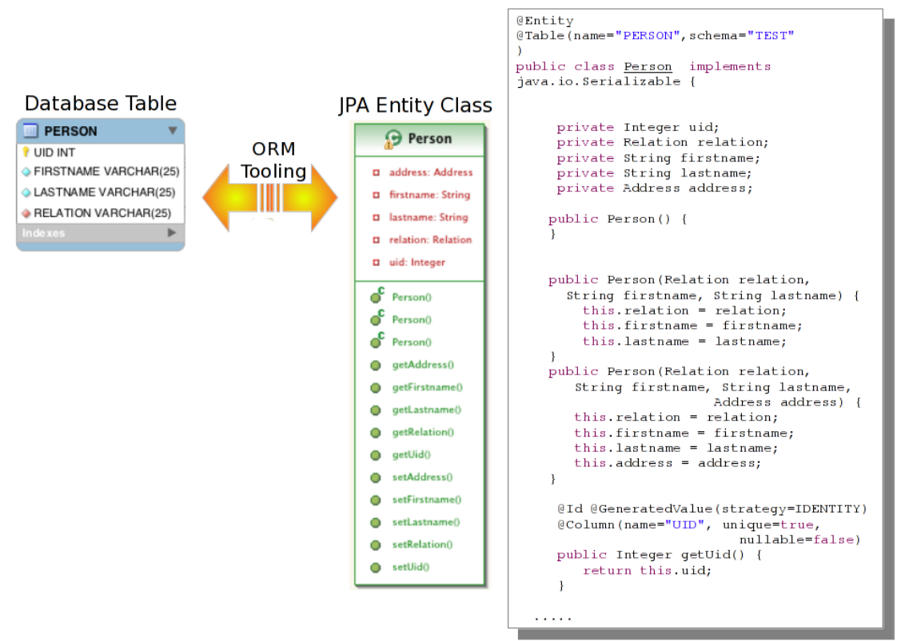

## Java Persistence 简介

Java is object oriented, whereas most Databases(Mysql, Oracle, etc) are not. Java Persistence 用来解决此类问题, Java Persistence provides a bridge between the Database and Java objects. where columns in rows in a database are mapped to fields in an instance of a Java object.

## 连接到数据库

通过如下四个步骤连接到数据库:

* A database

* A Java-based driver for that database

[http://dev.mysql.com/downloads/connector/j/](http://dev.mysql.com/downloads/connector/j/)

* A JBoss-specific datasource (ds.xml) definition using that driver

[WFTravel-ds.xml](WFTravel-ds.xml)

* A JPA persistence.xml file connecting an application to the datasource

[persistence.xml](persistence.xml)

## 示例 I - 部署 Datasource 到 WildFly

* 通过控制Console

[http://localhost:9990](http://localhost:9990)

* 通过控制CLI

执行如下CLI命令:

~~~
$ ./bin/jboss-cli.sh --connect --file=create-ds-mysql.cli
~~~

[create-ds-mysql.cli](create-ds-mysql.cli)

## JPA Entities

JPA Entity 与 数据库 Table 映射关系:

* Java Class to Database Table
* Java Instance to Database Row
* Java Field to Database Column

下图为一示例

相关annotation说明:

* **@Entity:** specifies, at the class level, that this Java class represents a JPA entity.
* **@Table:** specifies, at the class level, what table this class maps to, along with the schema (for some datasources this is required) which stores the table.
* **@Column:** specifies, at either the field, or the bean getter, level, which column in the database the field maps to.
* **@Id:** specifies the field which is the unique ID for the entry in the database.

## 映射生成 JPA Entities
